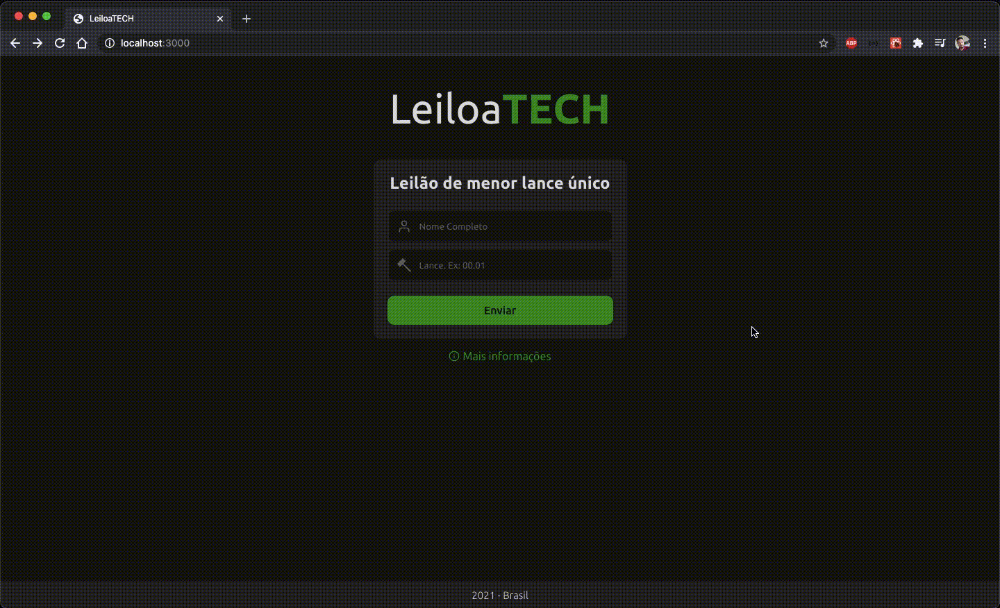

<h1 align="center">
  LeiloaTECH
</h1>

<h1 align="center">
  
</h1>

## Indice
<p align="center">
  <a href="#bookmark-sobre">Sobre</a> |
  <a href="#computer-tecnologias-utilizadas">Tecnologias</a> |
  <a href="#dart-objetivo">Objetivo</a> |
  <a href="#gear-requisitos">Requisitos</a> |
  <a href="#package-como-baixar-o-projeto">Baixar</a> |
  <a href="#bust_in_silhouette-autor">Autor</a> |
  <a href="#pencil-licença">Licença</a>
</p>

## :bookmark: Sobre
Aplicação web para realização de leilão de lance único

## :computer: Tecnologias Utilizadas

Front-End
- <a href="https://pt-br.reactjs.org/">ReactJS</a>
- <a href="https://www.typescriptlang.org/">Typescript</a>
- <a href="https://github.com/axios/axios">Axios</a>
- <a href="https://github.com/ReactTraining/react-router">React router dom</a>
- <a href="https://github.com/styled-components/styled-components">Styled Components</a>
- <a href="https://github.com/jquense/yup">Yup</a>
- <a href="https://github.com/uuidjs/uuid">uuid</a>
- <a href="https://github.com/unform/unform">Unform</a>
- <a href="https://github.com/styled-components/polished">polished</a>
- <a href="https://github.com/react-icons/react-icons">React Icons</a>
- <a href="https://github.com/pmndrs/react-spring">React Spring</a>

Back-End
- <a href="https://nodejs.org/pt-br/">Node.js</a>
- <a href="https://www.typescriptlang.org/">Typescript</a>
- <a href="https://github.com/expressjs/express">Express</a>
- <a href="https://github.com/axios/axios">Axios</a>
- <a href="https://github.com/typeorm/typeorm">Typeorm</a>
- <a href="https://github.com/expressjs/cors">Cors</a>
- <a href="https://github.com/arb/celebrate">Celebrate</a>
- <a href="https://github.com/uuidjs/uuid">uuid</a>

Database
- <a href="https://github.com/mapbox/node-sqlite3">sqlite</a>

## :dart: Objetivo
- Realizar um lance para o leilão
- Visualizar as regras do leilão
- Eleger um vencedor do leilão

- Ganha quem realizar o menor lance único

## :gear: Requisitos:
- Editor de código (recomendo o Visual Studio Code: https://code.visualstudio.com/)
- Node.js (https://nodejs.org/pt-br/)
- Yarn (https://classic.yarnpkg.com/en/docs/install/#mac-stable)

## :package: Como Baixar o projeto
Pelo seu terminal, escolha um local para o projeto e rode os comandos:
```bash
  # Clone o repositório
  $ git clone https://github.com/luizcampos331/leiloatech.git

  # Entre no diretório principal
  $ cd leiloatech

  # Entre na pasta do back-end
  $ cd backend

  # Instale as dependências
  $ yarn

  # Inicie o servidor para criar o banco de dados
  $ yarn start

  # Finalize o servidor
  $ ctrl + c

  # Crie as tabelas do banco de dados
  $ yarn typeorm migration:run

  # Inicie o servidor
  $ yarn dev:server

  # Abra um novo terminal e vá até a pasta do diretório principal
  # Entre na pasta do front-end
  $ cd frontend

  # Instale as dependências
  $ yarn

  # Inicie o servidor
  $ yarn start

```

## :bust_in_silhouette: Autor:
Luiz Eduardo Campos da Silva</br>
LinkedIn: <a href="https://www.linkedin.com/in/luiz-campos">@luiz-campos</a></br>
Github: <a href="https://www.github.com/luizcampos331">@luizcampos331</a>


## :pencil: Licença
Copyright © 2020 <a href="https://www.github.com/luizcampos331">Luiz Campos</a></br>
Este projeto é licenciado pelo <a href="LICENSE">MIT</a>
